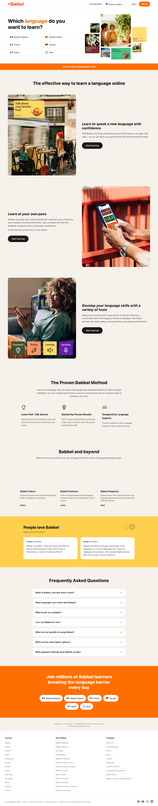
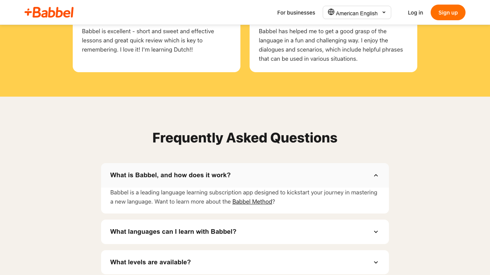

# Babbel.com Mock

A pixel-perfect, fully functional mock of [babbel.com](https://babbel.com) — the language learning platform's marketing landing page.

## Features

- **Header/Navigation** — Sticky header with Babbel logo, language selector, auth buttons
- **Hero Section** — Language selection grid (6 languages with flag icons), hero image, subscription banner
- **Feature Cards** — Three alternating image/text cards with CTAs
- **Proven Method** — Three-column layout with SVG icons
- **Babbel & Beyond** — Content cards for Videos, Podcasts, and Magazine
- **Reviews Carousel** — Testimonial slider with Previous/Next navigation
- **FAQ Accordion** — Seven expandable/collapsible questions with chevron animation
- **CTA Section** — Orange call-to-action with language buttons
- **Footer** — Three navigation columns, legal links, social media icons
- **Responsive Design** — Mobile-friendly breakpoints at 768px
- **Accessibility** — Skip-to-content link, ARIA attributes, keyboard navigation

## Tech Stack

| Layer | Technology |
|-------|-----------|
| Frontend | Vanilla JS + CSS |
| Build Tool | Vite + vite-plugin-singlefile |
| Testing | Vitest + jsdom |
| Containerization | Docker (nginx:alpine) |
| CI/CD | GitHub Actions |

## Getting Started

### Prerequisites
- Node.js 20+
- npm

### Installation
```bash
cd frontend
npm install
```

### Development
```bash
cd frontend
npm run dev
# Open http://localhost:5173
```

### Production Build
```bash
cd frontend
npm run build
# Output: frontend/dist/index.html (single self-contained file)
```

### Docker
```bash
docker-compose up --build
# Open http://localhost:5173
```

## Screenshots

### Full Homepage


### Header & Hero


### FAQ Accordion (Expanded)


## Testing

```bash
cd frontend
npm test
```

**Results: 43 tests passing across 10 test files**

| Test File | Tests |
|-----------|-------|
| header.test.js | 4 |
| hero.test.js | 5 |
| features.test.js | 4 |
| method.test.js | 4 |
| beyond.test.js | 3 |
| reviews.test.js | 7 |
| faq.test.js | 6 |
| cta.test.js | 3 |
| footer.test.js | 5 |
| main.test.js | 2 |

## Project Structure

```
├── .github/workflows/ci.yml    # CI/CD pipeline
├── assets/                      # Downloaded site assets
├── docker-compose.yml           # Docker orchestration
├── frontend/
│   ├── Dockerfile               # Multi-stage Docker build
│   ├── nginx.conf               # Nginx configuration
│   ├── index.html               # Entry point
│   ├── package.json             # Dependencies
│   ├── vite.config.js           # Vite + singlefile plugin
│   ├── public/assets/           # Static assets served by Vite
│   └── src/
│       ├── main.js              # App initialization
│       ├── style.css            # All styles (global + components + responsive)
│       ├── components/
│       │   ├── header.js        # Navigation bar
│       │   ├── hero.js          # Hero section + language grid
│       │   ├── features.js      # Feature cards
│       │   ├── method.js        # Proven Method section
│       │   ├── beyond.js        # Babbel & Beyond section
│       │   ├── reviews.js       # Reviews carousel
│       │   ├── faq.js           # FAQ accordion
│       │   ├── cta.js           # CTA section
│       │   └── footer.js        # Footer
│       └── __tests__/           # Unit tests (one per component)
├── screenshots/                 # Playwright screenshots
└── .pipeline/                   # Pipeline state files
```
